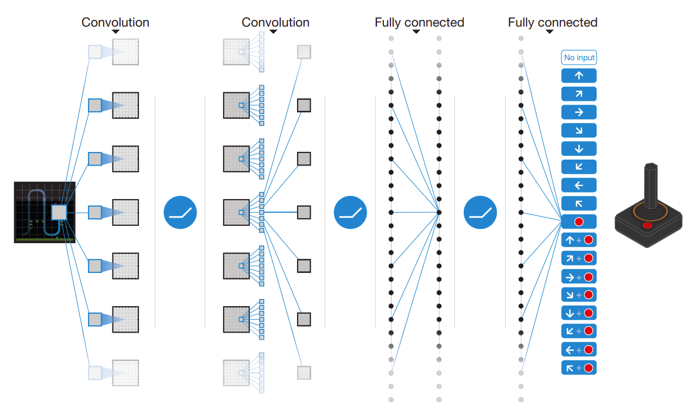
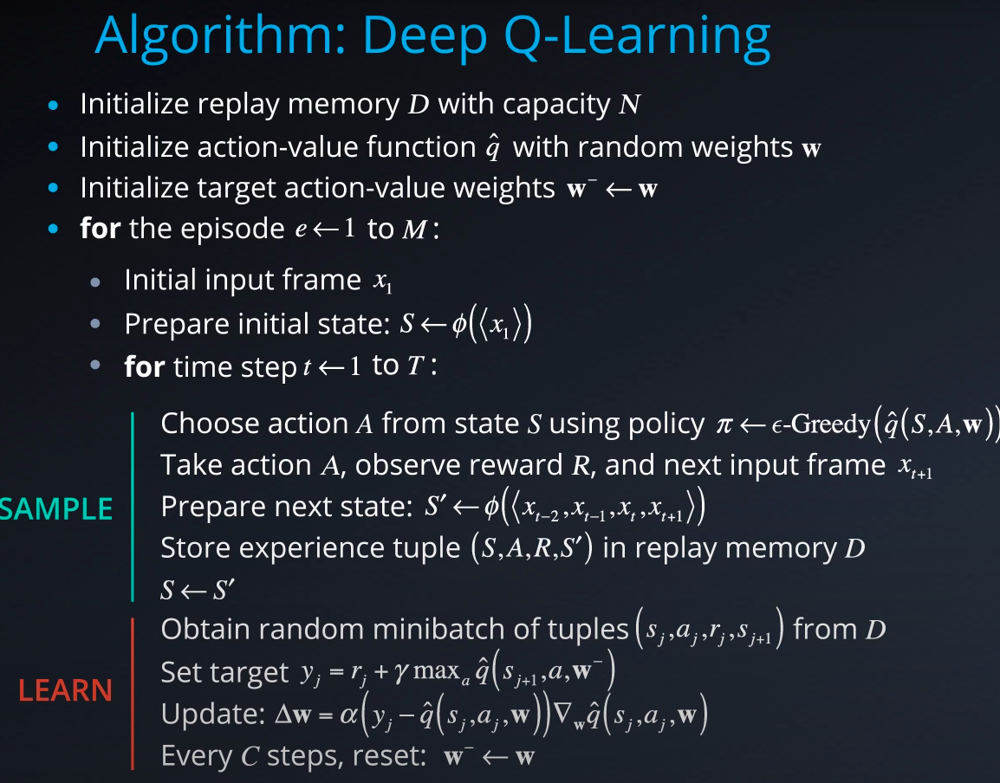
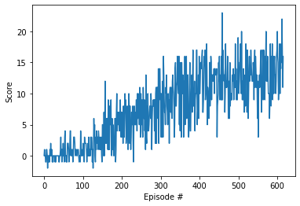
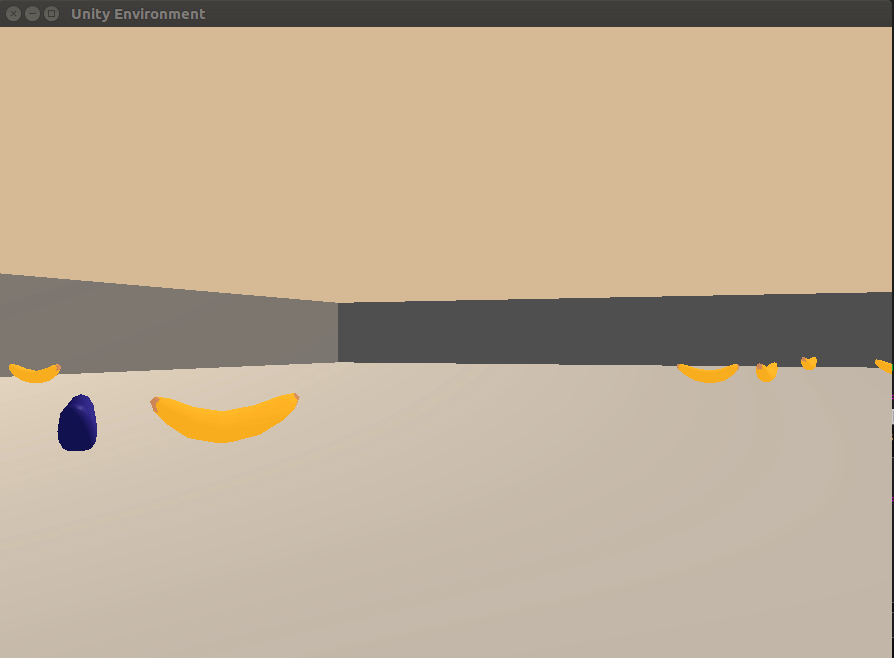
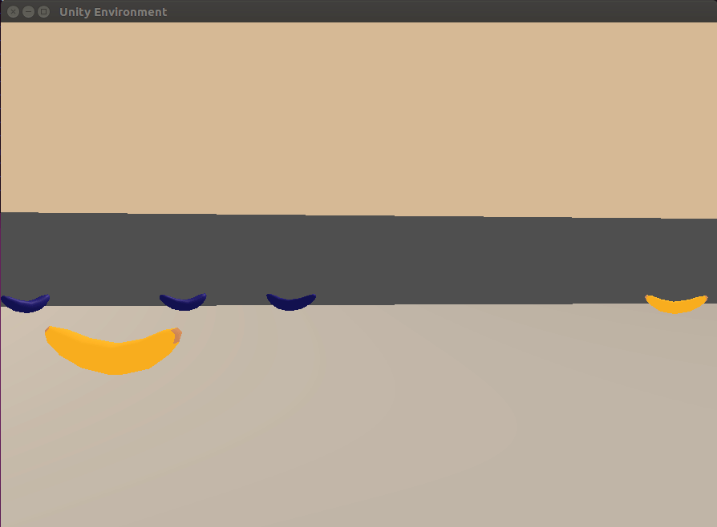

# Project 1: Navigation

Author: [Sushil Thapa](http://github.com/Sushil-Thapa) 

## REPORT

## Description
The project demonstrates the ability of value-based methods, specifically, [Deep Q-learning](https://storage.googleapis.com/deepmind-media/dqn/DQNNaturePaper.pdf) to learn a suitable policy in a model-free Reinforcement Learning setting using a Unity environment.  


[//]: # (Image References)

[image1]: https://user-images.githubusercontent.com/10624937/42135619-d90f2f28-7d12-11e8-8823-82b970a54d7e.gif "Trained Agent"

For this project, we trained an agent to navigate (and collect bananas!) in a large, square world.  

![Trained Agent][image1]

A reward of +1 is provided for collecting a yellow banana, and a reward of -1 is provided for collecting a blue banana.  Thus, the goal of our agent is to collect as many yellow bananas as possible while avoiding blue bananas.  

The state space has 37 dimensions and contains the agent's velocity, along with ray-based perception of objects around agent's forward direction.  Given this information, the agent has to learn how to best select actions.  Four discrete actions are available, corresponding to:
- **`0`** - move forward.
- **`1`** - move backward.
- **`2`** - turn left.
- **`3`** - turn right.

The task is episodic, and in order to solve the environment, our agent got an average score of +13 over 100 consecutive episodes.

For this project, we trained an agent to navigate (and collect bananas!) in a large, square world.  


## Algorithm

We used deep Q-learning that can learn successful policies directly from high-dimensional sensoryinputs using end-to-end reinforcement learning. With only the pixels and the game score as inputs we can train same network for a number of atari games as well as the banana game mentioned above.   

We parameterize an approximate value function $Q(s,a;\theta_{i})$ using the deep neural network which $\theta_i$ are the parameters (that is, weights) of the Q-network at iteration i. 

During learning, we
apply Q-learning updates, on samples (or minibatches) of experience drawn uniformly at random from the pool of stored samples.

Here is the schematic illustration of CNN based Deep-Q learning proposed by the official Paper. Note that We used simple ANN based Neural Nets because of its reduced complexity.  
 

Also, The algorithm for the Deep Q-Network is shown below.  
 

## Training

We solved the environment and achieved the required reward of +13 in mere 516 episodes(requirement was to achieve it before 2k episodes). Here is the training graph of the network.



Here is the overall average summary across episodes.
```
Episode 100	Average Score: 0.45
Episode 200	Average Score: 2.97
Episode 300	Average Score: 6.56
Episode 400	Average Score: 9.43
Episode 500	Average Score: 11.99
Episode 600	Average Score: 12.66
Episode 616	Average Score: 13.05
Environment solved in 516 episodes!	Average Score: 13.05
```

### Hyperparameters

  Here are the hyperparameters used:  
  
| Hyperparameter                      | Value |
| ----------------------------------- | ----- |
| Replay buffer size                  | 1e5   |
| Batch size                          | 64    |
| $\gamma$ (discount factor)          | 0.99  |
| $\tau$                              | 1e-3  |
| Learning rate                       | 5e-4  |
| update interval                     | 4     |
| Number of episodes                  | 600   |
| Max number of timesteps per episode | 2000  |
| Epsilon start                       | 1.0   |
| Epsilon minimum                     | 0.1   |
| Epsilon decay                       | 0.995 |
| Random Seed                         | 42    |
  
  
### Model Configuration  
| Model Parameters                    | Value   |
| ----------------------------------- | ------- |
| Fully Connected Layer 1 (Input)     | (37,512)|
| Fully Connected Layer 1             |(512,512)|
| Fully Connected Layer 1             |(512,256)|
| Fully Connected Layer 1             | (256,64)|
| Fully Connected Layer 1 (Output)    | (64,4)  |


## Visualization

| Random Agent                               | ANN-Based DQN                      | 
| ------------------------------------------ | ---------------------------------- | 
|      |  | 


## Future Work

- Hyperparameter search for DQNs and adding convolutional architecture should lead to better performance too.
- Using techniques like Prioritized Replay ([paper](https://arxiv.org/abs/1511.05952)), Dueling Networks or others as well as the combination of all of them(called Rainbow agent) can show a massive improvement over Double DQNs for Atari games and here as well. 
- Other improvements to the original DQN algorithms like earning from [multi-step bootstrap targets](https://arxiv.org/abs/1602.01783) , [Distributional DQN](https://arxiv.org/abs/1707.06887), [Noisy DQN](https://arxiv.org/abs/1706.10295)
