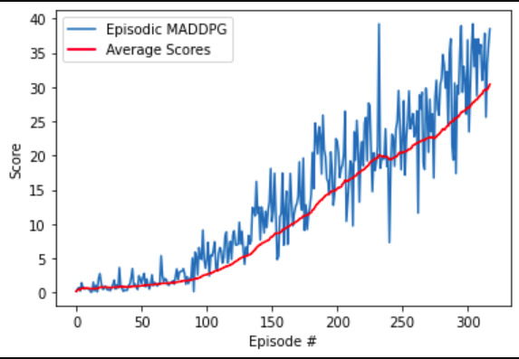

# Project 3: Continuous Control

Author: [Sushil Thapa](http://github.com/Sushil-Thapa) 

## REPORT

## Description
The project demonstrates the ability of policy gradient methods, specifically, [Deep Deterministic Policy Gradient Methods](https://arxiv.org/abs/1509.02971) to learn a suitable policy in a continuous Reinforcement Learning setting using a Unity environment.  


[//]: # (Image References)

[image1]: https://user-images.githubusercontent.com/10624937/43851024-320ba930-9aff-11e8-8493-ee547c6af349.gif "Trained Agent"

In this environment, a double-jointed arm can move to target locations. A reward of +0.1 is provided for each step that the agent's hand is in the goal location. Thus, the goal of your agent is to maintain its position at the target location for as many time steps as possible.

The observation space consists of 33 variables corresponding to position, rotation, velocity, and angular velocities of the arm. Each action is a vector with four numbers, corresponding to torque applicable to two joints. Every entry in the action vector should be a number between -1 and 1.

![Trained Agent][image1]

### Solving the Environment
Note that your project submission need only solve one of the two versions of the environment.

Option 1: Solve the First Version
The task is episodic, and in order to solve the environment, your agent must get an average score of +30 over 100 consecutive episodes.


## Algorithm

DDPG is the centralized training and decentralized execution algorithm that can be used in multi agent environments like cooperative, competitive and mixed scenarios. In the DDPG paper, they introduced this algorithm as an "Actor-Critic" method. Though, some researchers think DDPG is best classified as a DQN method for continuous action spaces.

The authors of DDPG paper adapt the ideas underlying the success of Deep Q-Learning to the continuous action domain. They present an actor-critic, model-free algorithm based on the deterministic policy gradient that can operate over continuous action spaces. Using the same learning algorithm, network architecture and hyper-parameters, the algorithm robustly solves more than 20 simulated physics tasks, including classic problems such as cartpole swing-up, dexterous manipulation, legged locomotion and car driving. This algorithm is able to find policies whose performance is competitive with those found by a planning algorithm with full access to the dynamics of the domain and its derivatives. Authors further demonstrate that for many of the tasks the algorithm can learn policies end-to-end: directly from raw pixel inputs.

Here is the basic working of both actor and critic aspects of DDPG and how they optimize/update their weights.   
 

Also, The algorithm for the DDPG is shown below.  
 

## Training

We solved the environment and achieved the required reward of +30 in mere ~300 episodesss. Here is the training graph of the network.



Here is the overall average summary across episodes.
```
Episode 50	Average Score: 0.98
Episode 100	Average Score: 2.58
Episode 150	Average Score: 8.08
Episode 200	Average Score: 14.95
Episode 250	Average Score: 20.39
Episode 300	Average Score: 26.77
Episode 318	Average Score: 30.39
Environment solved in 318 episodes!  	|	Average Score: 30.39
```

### Hyperparameters

  Here are the hyperparameters used:  
  
| Hyperparameter                      | Value |
| ----------------------------------- | ----- |
| Replay buffer size                  | 1e5   |
| Batch size                          | 192   |
| $\gamma$ (discount factor)          | 0.99  |
| $\tau$                              | 1e-3  |
| Learning rate (Actor)               | 1.5e-4|
| Learning rate (Critic)              | 1.5e-4|
| Max number of timesteps per episode | 1000  |
| Random Seed                         | 3     |
  
  
### Model Configuration  
| Actor Parameters                    | Value   |
| ----------------------------------- | ------- |
| Fully Connected Layer 1 (Input)     | (33,600)|
| Fully Connected Layer 2             |(600,400)|
| Fully Connected Layer 3             |(400,200)|
| Fully Connected Layer 4 (Output)    | (200,4) |

| Critic Parameters                   | Value   |
| ----------------------------------- | ------- |
| Fully Connected Layer 1 (Input)     | (33,400)|
| Fully Connected Layer 2             |(404,300)|
| Fully Connected Layer 3 (Output)    | (300,1) |


## Visualization

| Random Agent                               | ANN-Based DDPG                      | 
| ------------------------------------------ | ---------------------------------- | 
|      |  | 


## Future Work
- [x] Artificial Neural Network based search for DDPGs 
- [ ] Hyperparameter search for DDPGs and adding convolutional architecture or using batch normalization should lead to better performance. 
- [ ] Prioritized Experience Replay and Hindsight Experience Replay
- [ ] Experimenting with Different agents: D4PG, PPO, TD3, SAC, PlanNet and Dreamer.
