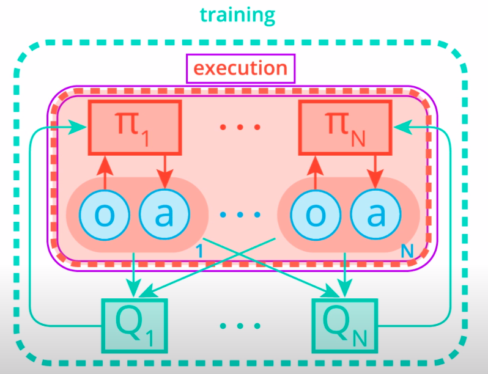
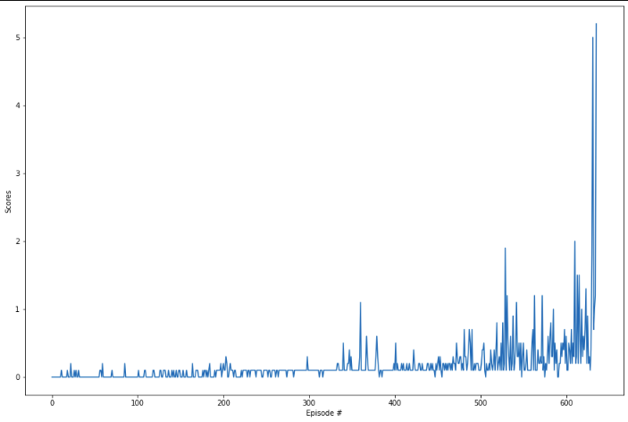
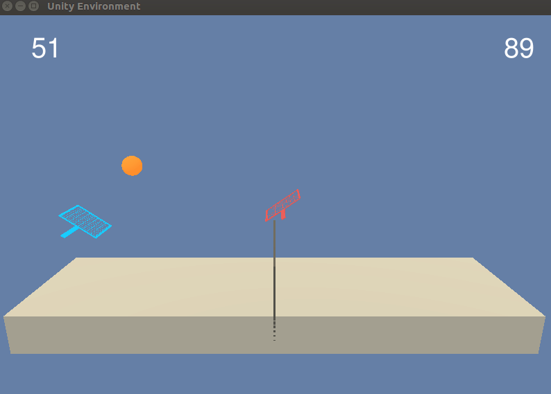
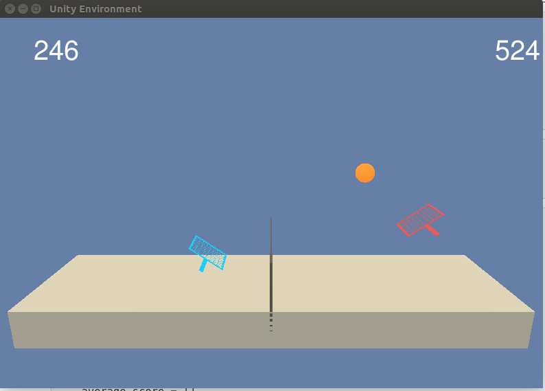

# Project 3: Multi-Agent Collaboration & Competition

Author: [Sushil Thapa](http://github.com/Sushil-Thapa) 

## REPORT

## Description
The project demonstrates the ability of value-based methods, specifically, [Multi-Agent Actor-Critic for Mixed Cooperative-Competitive Environments](https://arxiv.org/pdf/1706.02275.pdf) to learn a suitable policy in a multi agent Reinforcement Learning setting using a Unity environment.  


[//]: # (Image References)

[image1]: https://user-images.githubusercontent.com/10624937/42135623-e770e354-7d12-11e8-998d-29fc74429ca2.gif "Trained Agent"

In this environment, two agents control rackets to bounce a ball over a net. If an agent hits the ball over the net, it receives a reward of +0.1. If an agent lets a ball hit the ground or hits the ball out of bounds, it receives a reward of -0.01. Thus, the goal of each agent is to keep the ball in play.

The observation space consists of 8 variables corresponding to the position and velocity of the ball and racket. Each agent receives its own, local observation. Two continuous actions are available, corresponding to movement toward (or away from) the net, and jumping.

The task is episodic, and in order to solve the environment, your agents must get an average score of +0.5 (over 100 consecutive episodes, after taking the maximum over both agents). Specifically, After each episode, we add up the rewards that each agent received (without discounting), to get a score for each agent. This yields 2 (potentially different) scores. We then take the maximum of these 2 scores.
This yields a single score for each episode.
The environment is considered solved, when the average (over 100 episodes) of those scores is at least +0.5.  

![Trained Agent][image1]


## Algorithm

MADDPG is the centralized training and decentralized execution algorithm that can be used in multi agent environments like cooperative, competitive and mixed scenarios.

It introduces deep reinforcement learning methods for multi-agent domains. We begin by analyzing the difficulty of traditional algorithms in the multi-agent case: Q-learning is challenged by an inherent non-stationarity of the environment, while policy gradient suffers from a variance that increases as the number of agents grows.
We then present an adaptation of actor-critic methods that considers action policies of other agents and is able to successfully learn policies that require complex multiagent coordination. Additionally, we introduce a training regimen utilizing an ensemble of policies for each agent that leads to more robust multi-agent policies.
We show the strength of our approach compared to existing methods in cooperative as well as competitive scenarios, where agent populations are able to discover
various physical and informational coordination strategies. 

We parameterize an approximate value function $Q(s,a;\theta_{i})$ using the deep neural network which $\theta_i$ are the parameters (that is, weights) of the Q-network at iteration i. 

During learning, we
apply Q-learning updates, on samples (or minibatches) of experience drawn uniformly at random from the pool of stored samples.

Here is the schematic illustration of MADDPG.  
 

## Training

We solved the environment and achieved the required reward of +0.5 in mere 536 episodes(requirement was to achieve it before 2k episodes). Here is the training graph of the network.



Here is the overall average summary across episodes.
```
Episode 0050	 Average Score: 0.014
Episode 0100	 Average Score: 0.014
Episode 0150	 Average Score: 0.023
Episode 0200	 Average Score: 0.039
Episode 0250	 Average Score: 0.063
Episode 0300	 Average Score: 0.085
Episode 0350	 Average Score: 0.106
Episode 0400	 Average Score: 0.138
Episode 0450	 Average Score: 0.147
Episode 0500	 Average Score: 0.182
Episode 0550	 Average Score: 0.284
Episode 0600	 Average Score: 0.333
-- Environment solved in 536 episodes!                 
-- Average Score: 0.525 over past 100 episodes
```

### Hyperparameters

  Here are the hyperparameters used:  
  
| Hyperparameter                      | Value |
| ----------------------------------- | ----- |
| Replay buffer size                  | 1e6   |
| Batch size                          | 128   |
| $\gamma$ (discount factor)          | 0.99  |
| $\tau$                              | 7e-2  |
| Learning rate (Actor)               | 1e-3  |
| Learning rate (Critic)              | 1e-3  |
| update interval                     | 5     |
| Number of episodes                  | 2000  |
| Max number of timesteps per episode | 1000  |
| Random Seed                         | 0     |
  
  
### Model Configuration  
| Actor Parameters                    | Value   |
| ----------------------------------- | ------- |
| Fully Connected Layer 1 (Input)     | (48,256)|
| Fully Connected Layer 2             |(256,128)|
| Fully Connected Layer 3 (Output)    | (128,2) |

| Critic Parameters                    | Value   |
| ----------------------------------- | ------- |
| Fully Connected Layer 1 (Input)     | (48,256)|
| Fully Connected Layer 2             |(260,128)|
| Fully Connected Layer 3 (Output)    | (128,1) |


## Visualization

| Random Agent                               | ANN-Based MADDPG                      | 
| ------------------------------------------ | ---------------------------------- | 
|      |  | 


## Future Work
- [x] Artificial Neural Network based D search for DQNs and adding convolutional architecture should lead to better performance too.
- [ ] Hyperparameter search for MADDPGs and adding convolutional architecture or using batch normalization should lead to better performance too.
- [ ] Exploring ways to add multiagent systems(MARL) in addition to single agent. 
